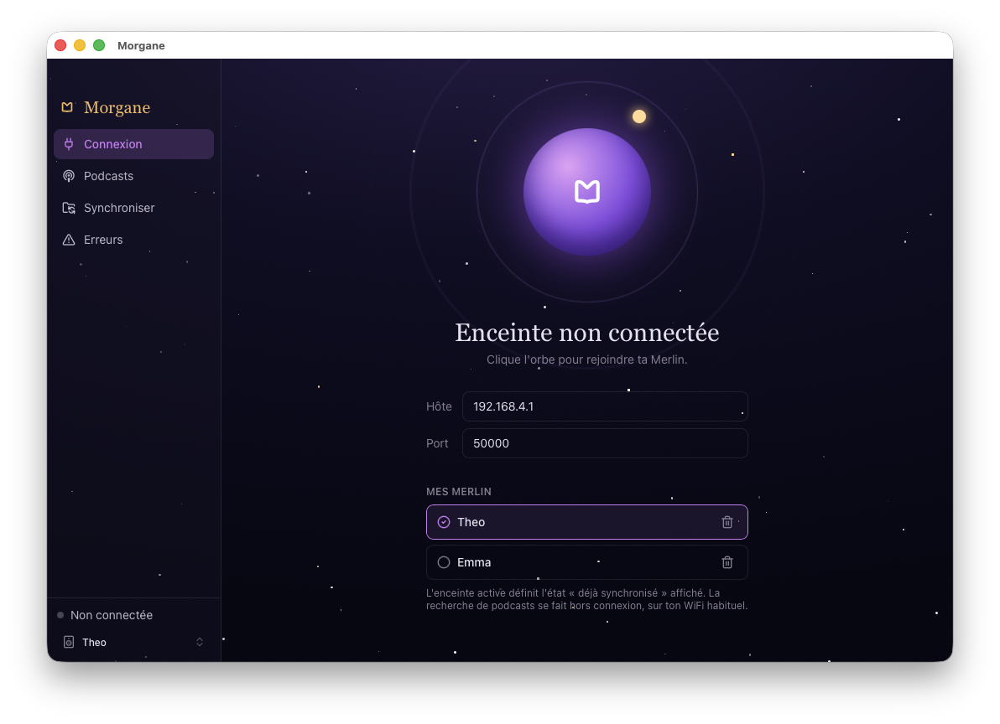
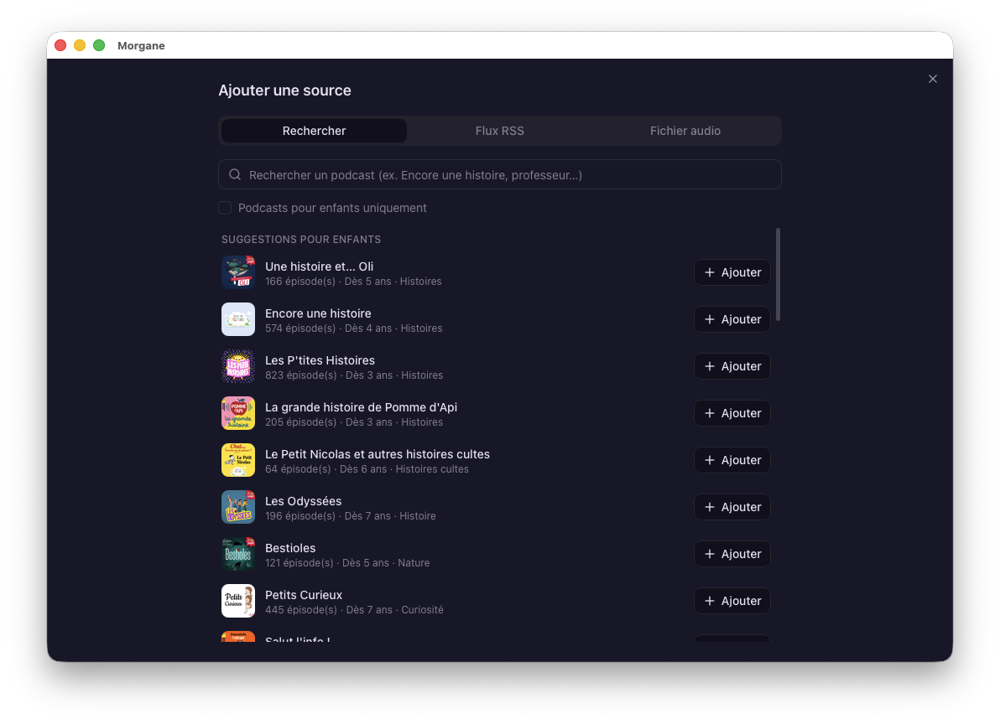
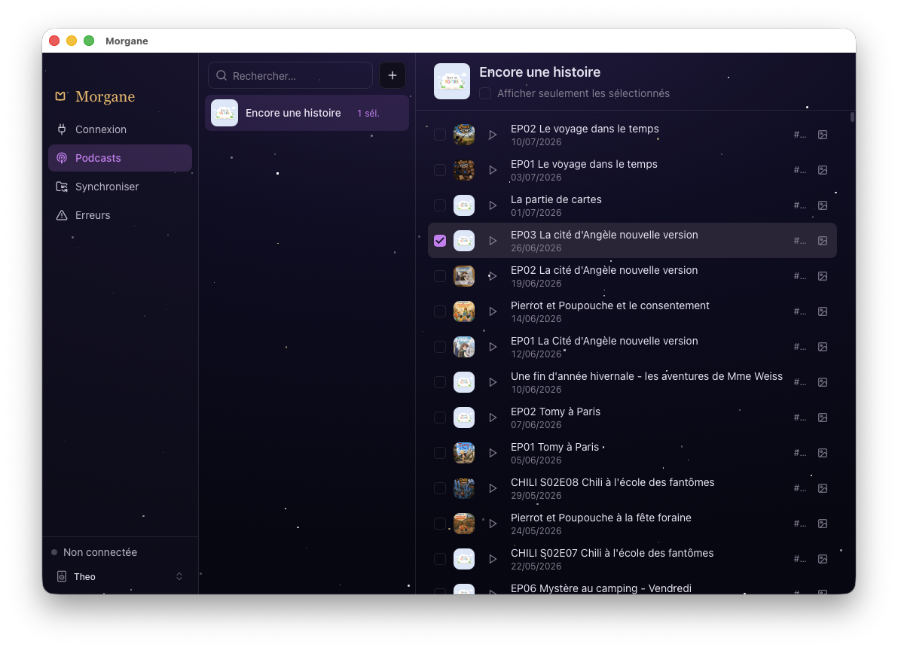
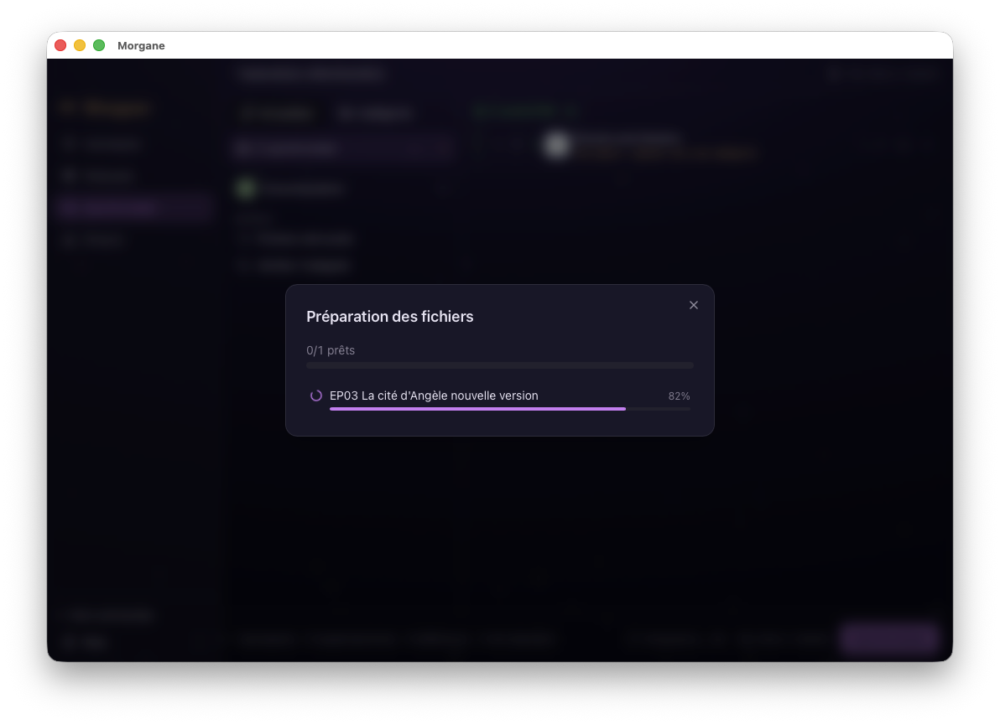
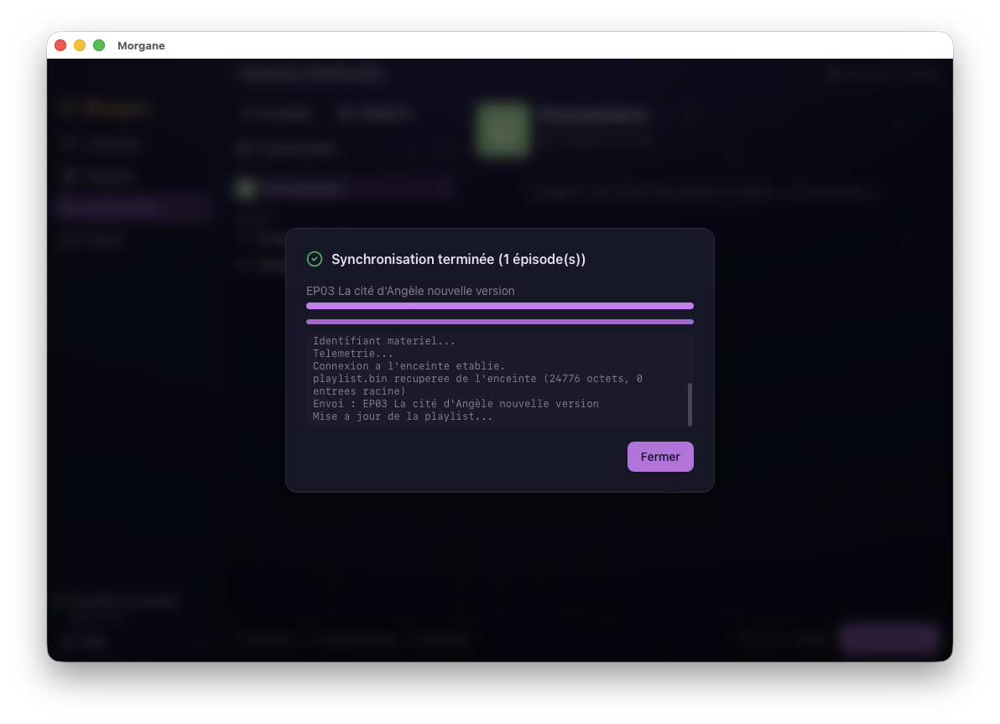

<p align="center">
  
</p>

<h1 align="center">Morgane</h1>

<p align="center">
  <strong>Toutes les histoires du monde, racontées par ta Merlin.</strong>
</p>

<p align="center">
  Application de bureau <strong>libre et indépendante</strong> pour envoyer
  n'importe quel podcast vers l'enceinte audio pour enfants <strong>Merlin</strong>,
  en Wi-Fi direct — sans compte, sans cloud, sans passer par le catalogue officiel.
</p>

<p align="center">
  <em>Rust + Tauri · macOS · Windows · Linux · GPL-3.0</em>
</p>

---

> ⚠️ **Projet indépendant, non officiel.** Non affilié à, ni approuvé par Bayard,
> Radio France ou La Chouette Radio. « Merlin » est une marque de ses détenteurs
> respectifs, citée ici uniquement à titre descriptif (compatibilité).
> Voir [`DISCLAIMER.md`](./DISCLAIMER.md).

## À quoi ça sert

Tu choisis des épisodes de podcasts (les tiens, ou n'importe quel flux RSS public),
et Morgane les transfère sur ta Merlin par le Wi-Fi de l'enceinte. L'enceinte
s'endort pleine de nouvelles histoires — sans dépendre du catalogue officiel.

## Aperçu

<table>
  <tr>
    <td width="50%"><br/><sub>Connexion — l'orbe pour rejoindre l'enceinte</sub></td>
    <td width="50%"><br/><sub>Ajouter une source — suggestions & recherche</sub></td>
  </tr>
  <tr>
    <td width="50%"><br/><sub>Podcasts — choix des épisodes à envoyer</sub></td>
    <td width="50%"><br/><sub>Préparation des fichiers avant transfert</sub></td>
  </tr>
  <tr>
    <td colspan="2" align="center"><br/><sub>Synchronisation vers l'enceinte, épisode par épisode</sub></td>
  </tr>
</table>

## Le rituel en deux temps

L'enceinte n'accepte **qu'une seule connexion à la fois** : tu prépares sur ton
Wi-Fi habituel, puis tu rejoins celui de la Merlin pour transférer. Morgane gère
le verrou réseau.

| # | Réseau | Étape | Détail |
|---|--------|-------|--------|
| 1 | Wi-Fi Merlin | **Repère ta Merlin** | Une première fois, rejoins le Wi-Fi de l'enceinte : Morgane l'enregistre et lit ce qu'elle contient. |
| 2 | Wi-Fi maison | **Choisis & convertis** | De retour sur ton réseau, abonne-toi aux flux, coche les épisodes — Morgane prépare les fichiers. |
| 3 | Wi-Fi Merlin | **Reconnecte-toi** | Rejoins de nouveau le Wi-Fi de la Merlin ; Morgane retrouve l'enceinte. |
| 4 | Wi-Fi Merlin | **Synchronise** | Le changeset est poussé vers l'enceinte, avec la progression épisode par épisode. |

## Fonctionnalités

- **Connexion Wi-Fi directe** — Morgane parle à l'enceinte sur son protocole
  réseau (`192.168.4.1:50000`). Aucun serveur tiers : tout reste entre ton
  ordinateur et la boîte.
- **Flux RSS illimités** — abonne-toi à n'importe quel podcast public ; épisodes,
  images et métadonnées récupérés automatiquement.
- **Conversion embarquée** — FFmpeg est téléchargé au premier lancement s'il est
  absent, puis le transcodage se fait au bon format avec progression en direct.
- **Synchro par diff** — un calcul de différence détermine quoi ajouter ou
  retirer ; rien n'est ré-envoyé inutilement.
- **100 % local** — pas de compte, pas de télémétrie, pas de cloud. Code ouvert
  et auditable.
- **Plusieurs enceintes** — enregistre toutes tes Merlin, nomme-les, et Morgane
  garde l'état « déjà synchronisé » par appareil.

## ⚠️ Bêta

Morgane est en développement et repose sur un protocole reconstitué : **le contenu
de l'enceinte peut être corrompu**. En cas de souci, une resynchronisation avec
l'application Merlin officielle remet l'enceinte d'aplomb. Garde ta bibliothèque
locale comme référence.

## Installation

### Télécharger

Des binaires prêts à l'emploi (macOS universel, Windows x64, Linux x64) sont
publiés sur la [page des releases](https://github.com/Benjpoirier/Morgane/releases).
Ils ne sont **pas signés** :

- **macOS** : clic droit sur l'app → *Ouvrir* (ou `xattr -dr com.apple.quarantine Morgane.app`).
- **Windows** : SmartScreen → *Informations complémentaires* → *Exécuter quand même*.

Sinon, la compilation depuis les sources est décrite ci-dessous.

### Prérequis

- **Rust** (édition 2024) — via [rustup](https://rustup.rs)
- **Node.js 20.19+ ou 22+** et **pnpm** — `brew install node pnpm`
- **FFmpeg** — téléchargé automatiquement au premier lancement s'il est absent
  (sinon, s'il est déjà dans le PATH, il est réutilisé)

### Lancer

```sh
make ui-install   # installe les dépendances du frontend (une fois)
make run          # lance l'app (frontend Vite + backend Rust)
```

### Tester sans matériel

Un faux appareil reproduit le protocole de la Merlin en local :

```sh
make mock         # terminal 1 : faux appareil sur 192.168.4.1:50000 (sudo pour l'alias lo0)
make run          # terminal 2 : l'app se connecte au mock
```

### Autres commandes

```sh
make build        # compile le workspace Rust
make test         # lance tous les tests
make bundle       # empaquette l'app macOS (.app/.dmg via Tauri)
make debug-log    # trace le hexdump du protocole (RUST_LOG=merlin_protocol=debug)
```

## Architecture

Cœur en Rust (workspace Cargo) piloté par une UI **Tauri** (backend Rust fin +
frontend web React) :

| Crate / dossier | Rôle |
|---|---|
| `merlin-protocol` | Client TCP, framing, CRC-32/MPEG-2, opcodes |
| `merlin-domain` | Domaine pur (playlist.bin, merge, RSS, UUID déterministes) — zéro I/O |
| `merlin-infra` | SyncEngine, session, FFmpeg, images, SQLite |
| `merlin-application` | Use case de synchronisation |
| `merlin-mock-device` | Faux appareil (tests sans matériel) |
| `src-tauri` | Backend Tauri : commandes IPC + événements par-dessus les crates cœur |
| `app/` | Frontend React + Vite + TypeScript (shadcn/ui + Tailwind + Motion) |

Le contrat typé frontend ↔ backend (`app/src/lib/types.ts` ↔ dérives serde du
domaine) est verrouillé par `src-tauri/tests/wire_format.rs`.

## Contribuer

Les issues et pull requests sont les bienvenues. Avant une PR : `make test` doit
passer, et le frontend se construire (`pnpm -C app build`).

## Licence

Morgane est distribué sous licence **GNU General Public License v3.0 (ou
ultérieure)** — voir [`LICENSE`](./LICENSE). Il embarque la police *Cascadia Code*
(SIL Open Font License 1.1) et télécharge FFmpeg (GPL) au premier lancement ; les
attributions tierces figurent dans [`NOTICE`](./NOTICE).
